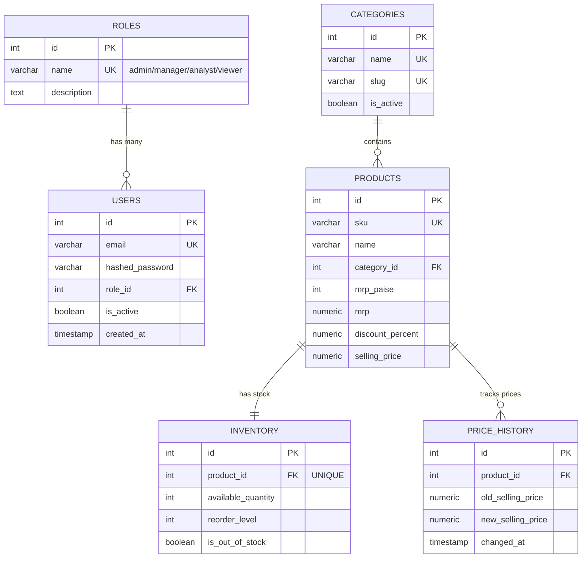

# 📊 StockPulse — Enterprise Retail Inventory Analytics Platform

> A production-ready, high-performance retail inventory analytics platform built with **FastAPI**, **PostgreSQL**, **React 18**, **TypeScript**, and **Material UI v6**.

[](https://fastapi.tiangolo.com/)
[](https://postgresql.org/)
[](https://react.dev/)
[](https://mui.com/)
[](https://typescriptlang.org/)
[](https://tailwindcss.com/)
[](LICENSE)

---

## 📌 Platform Overview

**StockPulse** is an internal dark-store analytics engine modeled after quick-commerce platforms (Zepto, Blinkit, Swiggy Instamart). It provides real-time visibility into stock health, category inventory valuations, and automated price-change audit trails across **3,700 SKUs**.

Engineered following **Clean Architecture (Router → Service → Repository)**, **SQL Normalization (2NF/3NF)**, and **JWT Role-Based Access Control (RBAC)**, StockPulse delivers sub-millisecond query performance and enterprise-grade code maintainability.

---

## ✨ Key Features

- **High-Cardinality Catalog**: Pre-populated with **3,700 real-world SKUs** across 11 normalized product categories.
- **Executive Analytics Dashboard**:
  - **Category Inventory Valuation Ranking**: Uses PostgreSQL `RANK()` window functions to rank product categories by total invested capital.
  - **Price Variance Audit Trail**: Uses PostgreSQL `LAG()` window functions to detect historical price and discount mutations per SKU.
  - **KPI Metrics Engine**: Uses Common Table Expressions (CTEs) to compute store valuation, out-of-stock percentages, and average discounts in a single database pass.
- **Stock Health & Reorder Control**:
  - **CASE-Based Stock Status**: Categorizes stock levels into `Critical`, `Low`, `Normal`, and `Overstocked`.
  - **Low-Stock Alert Feed**: Automatically identifies items below reorder thresholds.
  - **Manager Restock Transactions**: Atomic stock replenishment wrapped in database transactions.
- **Security & Authorization**:
  - **JWT Authentication**: Stateless HS256 tokens with configurable expiration.
  - **Role-Based Access Control (RBAC)**: 4 user roles (`admin`, `manager`, `analyst`, `viewer`).
  - **Bcrypt Password Security**: One-way salted hashing protecting user credentials.

---

## 🔑 Demo Account Credentials

Use any of the pre-configured accounts below to explore different RBAC permission levels:

| Role | Email | Password | Access Privileges |
|---|---|---|---|
| **Admin** | `admin@stockpulse.io` | `admin123` | Full administrative control & write access |
| **Manager** | `manager@stockpulse.io` | `manager123` | Stock restocking, product updates & management |
| **Analyst** | `analyst@stockpulse.io` | `analyst123` | Executive analytics dashboard & stock alert feeds |
| **Viewer** | `viewer@stockpulse.io` | `viewer123` | Read-only catalog & stock visibility |

---

## 🛠️ Technology Stack

| Layer | Technology | Rationale |
|---|---|---|
| **Frontend** | React 18, TypeScript, Material UI v6, Recharts | Type-safe SPA with accessible dark UI components and responsive data visualization |
| **Backend** | FastAPI, SQLAlchemy 2.0, Alembic, Pydantic v2 | High-performance Python framework with automatic OpenAPI docs and database migrations |
| **Database** | PostgreSQL (Supabase / Local) | Production relational DB supporting CTEs, window functions, views, and triggers |
| **Security** | JWT (PyJWT), Bcrypt (Passlib) | Stateless authentication with slow, salted password hashing |
| **Deployment** | Docker, Hugging Face Spaces, Vercel | Microservice containerization and modern cloud hosting |

---

## 🏛️ System Architecture

StockPulse enforces strict **Clean Architecture** to decouple HTTP handlers, business logic, and database persistence:

```
┌─────────────────────────────────────────────────────────┐
│              React 18 + Material UI Frontend             │
└────────────────────────────┬────────────────────────────┘
                             │ (REST APIs + JWT Bearer)
                             ▼
┌─────────────────────────────────────────────────────────┐
│            FastAPI Application Router Layer             │
│            (app/modules/*/router.py)                    │
└────────────────────────────┬────────────────────────────┘
                             │
                             ▼
┌─────────────────────────────────────────────────────────┐
│                   Service Business Layer                │
│            (app/modules/*/service.py)                   │
└────────────────────────────┬────────────────────────────┘
                             │
                             ▼
┌─────────────────────────────────────────────────────────┐
│               Repository Persistence Layer              │
│            (app/modules/*/repository.py)                │
└────────────────────────────┬────────────────────────────┘
                             │
                             ▼
┌─────────────────────────────────────────────────────────┐
│                  PostgreSQL Database                    │
└─────────────────────────────────────────────────────────┘
```

---

## 🗄️ Database ER Diagram



---

## 🚀 Quick Start Guide

### Prerequisites
- Node.js 18+
- Python 3.10+

### 1. Backend Setup
```bash
# Navigate to backend directory
cd backend

# Create & activate virtual environment
python -m venv .venv
.venv\Scripts\activate        # On Windows

# Install Python dependencies
pip install -r requirements.txt

# Configure environment variables
copy .env.example .env

# Run seed script (Populates DB with 3,700 SKUs and default users)
python -m app.scripts.seed

# Start FastAPI development server
python -m uvicorn app.main:app --reload --port 8000
```
*The API interactive documentation will be available at `http://localhost:8000/docs`.*

### 2. Frontend Setup
```bash
# Navigate to frontend directory
cd frontend

# Install Node dependencies
npm install

# Start Vite React development server
npm run dev
```
*The web interface will be live at `http://localhost:5173`.*

---

## 📁 Repository Structure

```
.
├── backend/
│   ├── alembic/              # Schema version control migrations
│   ├── app/
│   │   ├── core/             # Configuration, database connection & security
│   │   ├── models/           # SQLAlchemy ORM models (6 tables)
│   │   ├── modules/          # Clean Architecture feature modules
│   │   ├── scripts/          # Dataset generator & database seeder
│   │   └── main.py           # FastAPI application entry point
│   ├── data/                 # Dataset CSV storage
│   ├── Dockerfile            # Container definition
│   └── requirements.txt      # Python dependencies
├── frontend/
│   ├── src/
│   │   ├── components/       # Layout shell & ProtectedRoute guards
│   │   ├── pages/            # Dashboard, Products, Inventory, Login pages
│   │   ├── services/         # Axios API client with JWT interceptor
│   │   ├── store/            # Zustand authentication state store
│   │   ├── theme/            # Material UI v6 custom dark theme
│   │   └── types/            # TypeScript interfaces
│   ├── index.html
│   ├── package.json
│   └── vite.config.ts
├── docs/                     # Architecture, Database, & API documentation
├── learning/                 # Step-by-step engineering handbook
├── LICENSE                   # MIT License
└── README.md
```

---

## 📄 License

Distributed under the [MIT License](LICENSE).
