# 🗄️ Database Schema & Relational Design

## Relational Schema Diagram (Mermaid)

```mermaid
erDiagram
    ROLES ||--o{ USERS : "has many"
    CATEGORIES ||--o{ PRODUCTS : "contains"
    PRODUCTS ||--|| INVENTORY : "has stock"
    PRODUCTS ||--o{ PRICE_HISTORY : "tracks prices"

    ROLES {
        int id PK
        varchar name UK "admin/manager/analyst/viewer"
        text description
    }

    USERS {
        int id PK
        varchar email UK
        varchar hashed_password
        varchar full_name
        int role_id FK
        boolean is_active
        timestamp created_at
        timestamp updated_at
    }

    CATEGORIES {
        int id PK
        varchar name UK
        varchar slug UK
        boolean is_active
        timestamp created_at
    }

    PRODUCTS {
        int id PK
        varchar sku UK
        varchar name
        int category_id FK
        int mrp_paise
        numeric mrp
        numeric discount_percent
        numeric selling_price
        int weight_gms
        varchar quantity_desc
        boolean is_active
        timestamp created_at
        timestamp updated_at
    }

    INVENTORY {
        int id PK
        int product_id FK "UNIQUE"
        int available_quantity
        int reorder_level "default 10"
        boolean is_out_of_stock
        timestamp last_restocked_at
        timestamp updated_at
    }

    PRICE_HISTORY {
        int id PK
        int product_id FK
        numeric old_mrp
        numeric old_discount_percent
        numeric old_selling_price
        numeric new_mrp
        numeric new_discount_percent
        numeric new_selling_price
        varchar change_reason
        timestamp changed_at
    }
```

## Normalization Justification
- **2NF / 3NF Compliance**: Separated Category string repetition into `categories` table.
- **Single Responsibility Principle**: Catalog data (`products`) is decoupled from operational stock levels (`inventory`).
- **Auditability**: `price_history` maintains an append-only log populated via PostgreSQL triggers.
