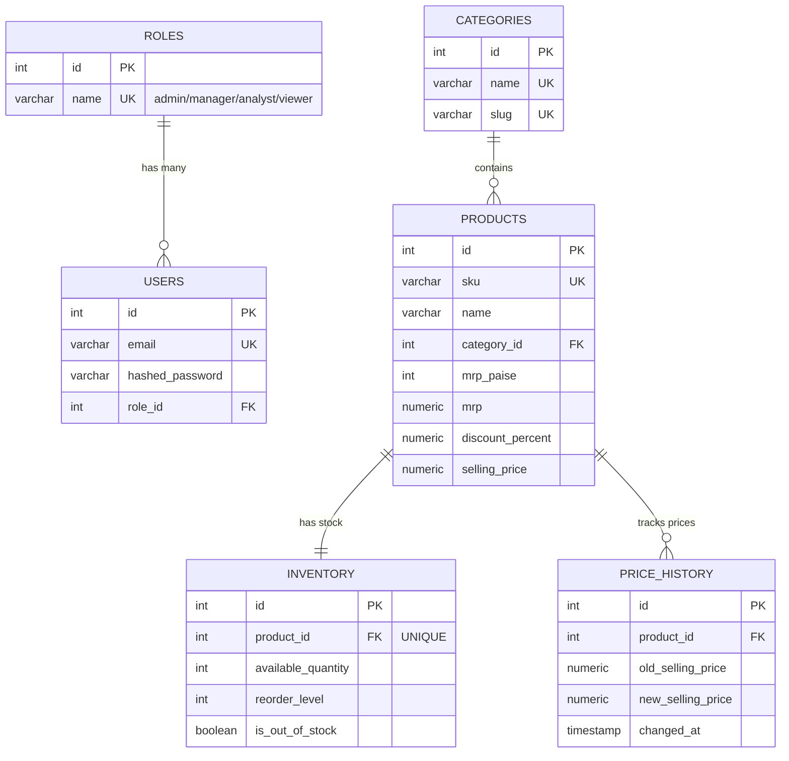

# 🗄️ 04: Relational Database Design Handbook

## 1. Objective
Master the 6 relational database tables in StockPulse, their primary/foreign key relationships, constraints, indexes, and normalization rules.

---

## 2. Database ER Diagram (Mermaid)

---

## 3. Table-by-Table Technical Reference

### Table 1: `roles` (`app/models/role.py`)
- **Purpose**: Defines RBAC user roles.
- **Columns**: `id` (PK), `name` (VARCHAR(50) UNIQUE), `description` (TEXT).
- **Consuming APIs**: `POST /auth/login`, `GET /auth/me`.

### Table 2: `users` (`app/models/user.py`)
- **Purpose**: System user authentication accounts.
- **Columns**: `id` (PK), `email` (VARCHAR(255) UNIQUE INDEX), `hashed_password`, `role_id` (FK -> roles.id), `is_active`, `last_login`.
- **Consuming APIs**: `POST /auth/login`, `GET /auth/me`.

### Table 3: `categories` (`app/models/category.py`)
- **Purpose**: Product category classification.
- **Columns**: `id` (PK), `name` (VARCHAR(120) UNIQUE), `slug` (VARCHAR(120) UNIQUE).
- **Consuming APIs**: `GET /categories`, `GET /products`.

### Table 4: `products` (`app/models/product.py`)
- **Purpose**: Core catalog SKU entity.
- **Columns**: `id` (PK), `sku` (VARCHAR(50) UNIQUE INDEX), `name` (VARCHAR(255) INDEX), `category_id` (FK -> categories.id), `mrp_paise`, `mrp`, `discount_percent`, `selling_price`.
- **Constraints**:
  - `ck_products_mrp_positive`: `mrp_paise >= 0`
  - `ck_products_discount_range`: `discount_percent BETWEEN 0 AND 100`

### Table 5: `inventory` (`app/models/inventory.py`)
- **Purpose**: Operational stock levels.
- **Columns**: `id` (PK), `product_id` (FK -> products.id UNIQUE), `available_quantity`, `reorder_level` (default 10), `is_out_of_stock`.
- **Constraints**: `ck_inventory_quantity_non_negative`: `available_quantity >= 0`.

### Table 6: `price_history` (`app/models/price_history.py`)
- **Purpose**: Append-only log of price changes.
- **Columns**: `id` (PK), `product_id` (FK -> products.id), `old_selling_price`, `new_selling_price`, `changed_at`.

---

## 4. Key Takeaways
- **6 Tables**, **10+ Constraints**, **5 B-Tree Indexes**.
- Proceed to [`05_SQL_QUERIES_EXPLAINED.md`](./05_SQL_QUERIES_EXPLAINED.md) for the Advanced SQL Handbook.
