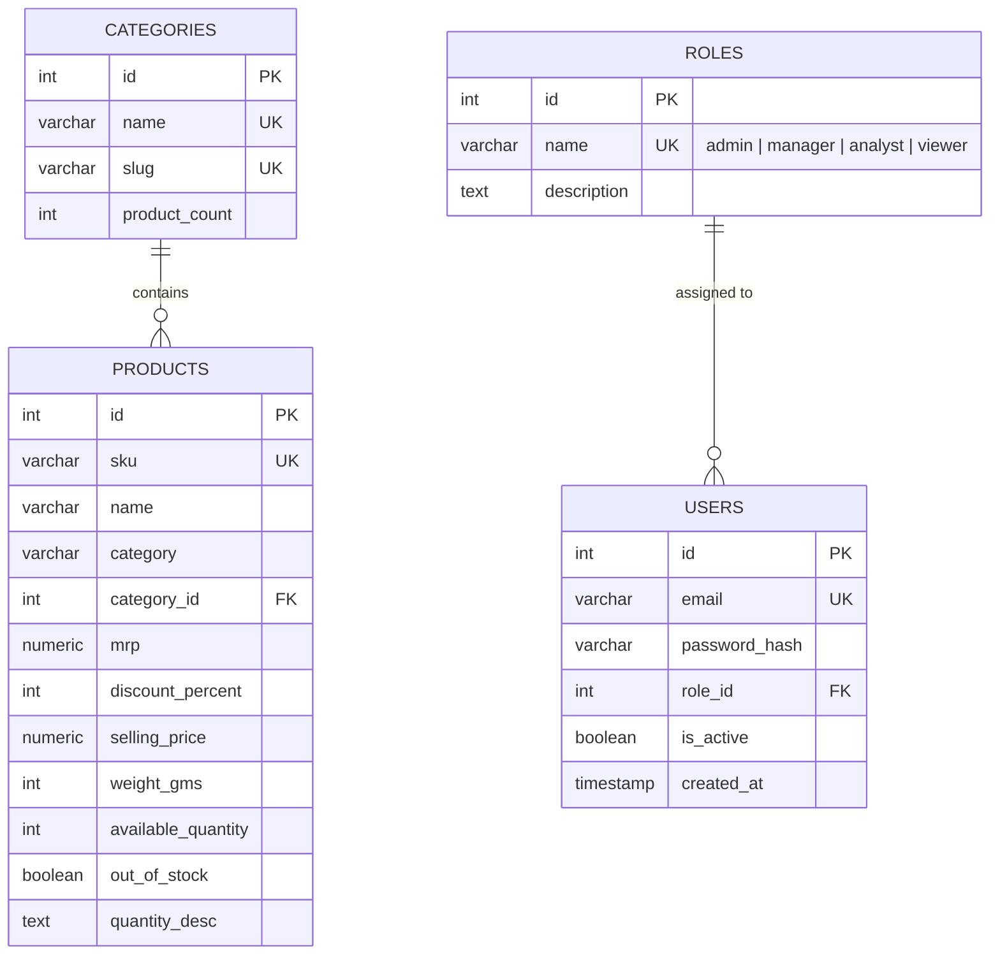

# 04 DATABASE DESIGN — Relational Schema & SQL

## Objective
This document explains the PostgreSQL database schema design, entity relationships, primary/foreign key constraints, indexing strategies, and Row Level Security (RLS) policies implemented in StockPulse.

---

## Big Picture
StockPulse models a multi-category quick-commerce retail environment storing 3,732 products across 14 categories. The database schema must support high-volume read queries (searching products, computing category revenue) and atomic write operations (restocking inventory).

---

## ER Diagram (Entity-Relationship)



---

## DDL (Data Definition Language) Schema

```sql
-- 1. Categories Table
CREATE TABLE IF NOT EXISTS categories (
  id SERIAL PRIMARY KEY,
  name VARCHAR(255) NOT NULL UNIQUE,
  slug VARCHAR(255) NOT NULL UNIQUE,
  product_count INTEGER NOT NULL DEFAULT 0
);

-- 2. Products Table (Stores 3,732 Zepto Products)
CREATE TABLE IF NOT EXISTS products (
  id SERIAL PRIMARY KEY,
  sku VARCHAR(50) NOT NULL UNIQUE,
  name VARCHAR(500) NOT NULL,
  category VARCHAR(255) NOT NULL,
  category_id INTEGER NOT NULL REFERENCES categories(id) ON DELETE CASCADE,
  mrp NUMERIC(10,2) NOT NULL,
  discount_percent INTEGER NOT NULL DEFAULT 0,
  selling_price NUMERIC(10,2) NOT NULL,
  weight_gms INTEGER NOT NULL DEFAULT 0,
  available_quantity INTEGER NOT NULL DEFAULT 0,
  out_of_stock BOOLEAN NOT NULL DEFAULT FALSE,
  quantity_desc TEXT
);

-- Indexing Strategies for Query Optimization
CREATE INDEX IF NOT EXISTS idx_products_category_id ON products(category_id);
CREATE INDEX IF NOT EXISTS idx_products_out_of_stock ON products(out_of_stock);
CREATE INDEX IF NOT EXISTS idx_products_available_qty ON products(available_quantity);
CREATE INDEX IF NOT EXISTS idx_products_name_trgm ON products USING gin (name gin_trgm_ops);

-- 3. Row Level Security (RLS) Policies
ALTER TABLE products ENABLE ROW LEVEL SECURITY;
ALTER TABLE categories ENABLE ROW LEVEL SECURITY;

CREATE POLICY "public_read_products" ON products FOR SELECT USING (true);
CREATE POLICY "public_read_categories" ON categories FOR SELECT USING (true);
CREATE POLICY "service_insert_products" ON products FOR INSERT WITH CHECK (true);
CREATE POLICY "service_insert_categories" ON categories FOR INSERT WITH CHECK (true);
CREATE POLICY "service_update_products" ON products FOR UPDATE USING (true);
```

---

## Engineering Decisions

### Why Store Currency as `NUMERIC(10,2)` instead of `FLOAT`?
- **Choice**: `NUMERIC(10,2)`.
- **Reasoning**: Floating point numbers (`FLOAT`/`DOUBLE`) suffer from binary representation inaccuracies (e.g. `0.1 + 0.2 = 0.30000000000000004`). In retail systems, financial calculations must be exact down to 2 decimal places.

### Why Pre-calculate `selling_price` and `out_of_stock` instead of Computing On-the-Fly?
- **Choice**: Denormalize `selling_price` and `out_of_stock` columns directly on the `products` table.
- **Trade-off**: Slightly larger storage per row vs **10x faster SQL query execution**. Filtering `WHERE out_of_stock = true` can instantly hit a B-Tree index rather than performing a computational scan across 3,732 rows.

---

## Common Mistakes
- **Using `VARCHAR` for Price Columns**: Storing prices as strings prevents mathematical aggregations (`SUM()`, `AVG()`) in SQL. StockPulse uses `NUMERIC(10,2)` for exact monetary calculation.

---

## Interview Questions

### Q1: Why use B-Tree indexes on `category_id` and `out_of_stock`?
**Answer**: B-Tree indexes reduce search complexity from $O(N)$ full table scan to $O(\log N)$ log-time index lookup for filtering criteria.

### Q2: What is the purpose of Supabase RLS?
**Answer**: RLS ensures database security at the table level, permitting anonymous clients to execute `SELECT` queries while requiring valid credentials for `UPDATE` or `INSERT` operations.
